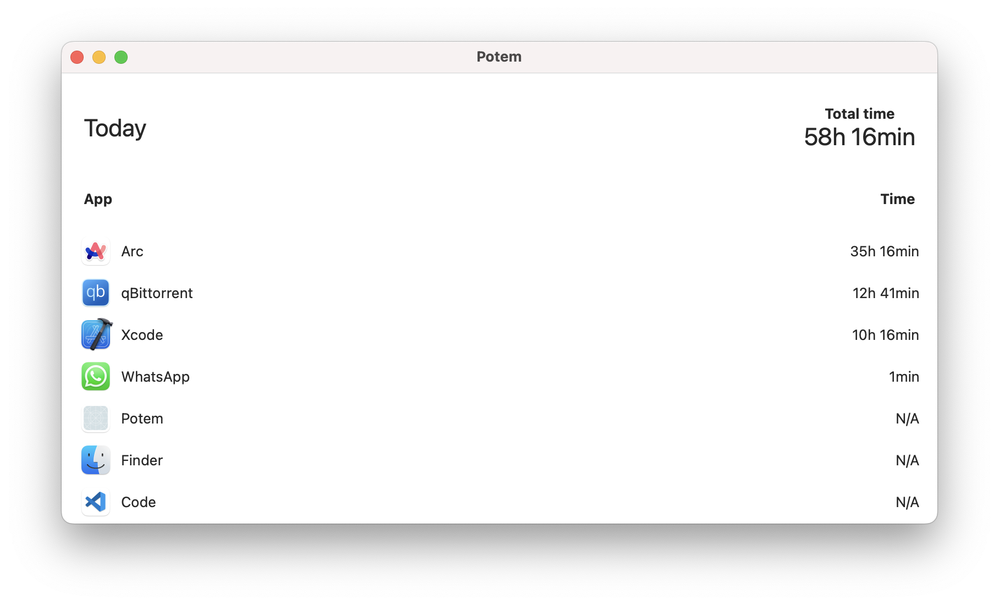

# Potem 

Potem is open-source a native macOS time-tracking app.

#### Stack: 
- Swift
- Swift UI

Our goal is to provide a minimalistic time-tracking app for general use.

#### MVP features:

- Automatic tracking
- Daily tracking
- Timeline overview
- Pomodoro

#### Long-term features:
- Manual tracking per app
- History
- Time management per app
- Defining working hours
- Projects

#### Vision:

As for now, all MVP features will be free, in the feature we might want to monetize some feature, therefore create subscription plans.

#### Design:

This is how the first iteraction should look like.

